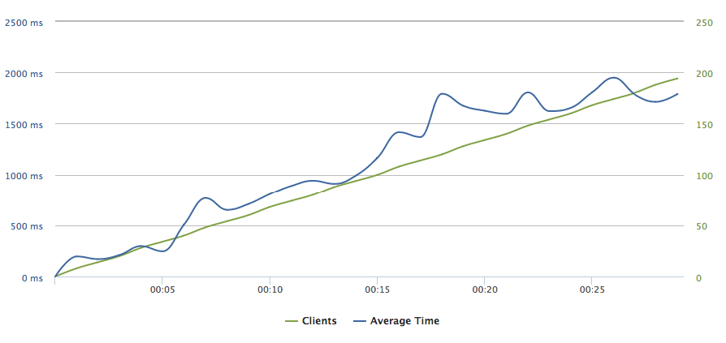
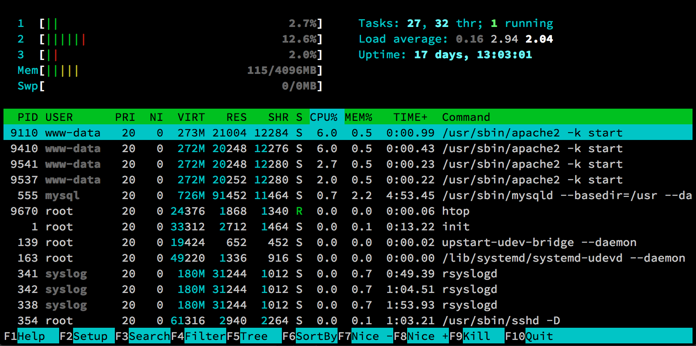
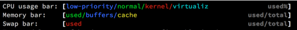
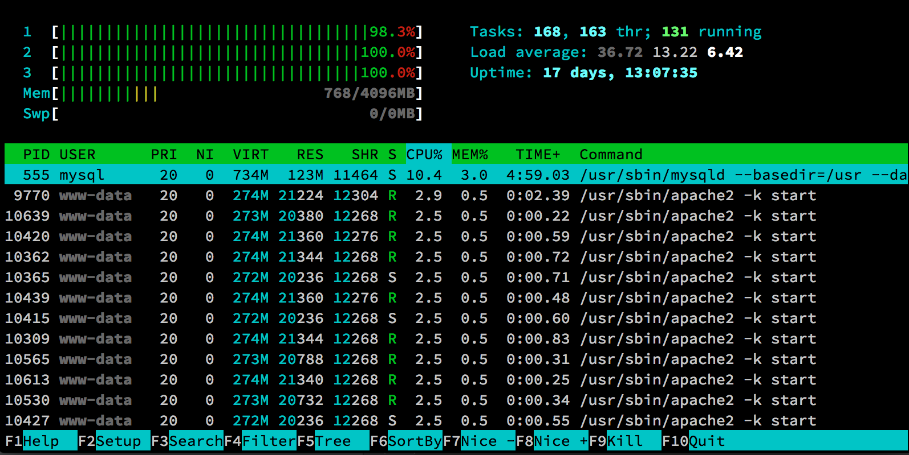

# Apache with mod_php

"Apache supports a variety of features, many implemented as compiled modules which extend the core functionality." "Instead of implementing a single architecture, Apache provides a variety of MultiProcessing Modules (MPMs), which allow Apache to run in a process-based, hybrid (process and thread) or event-hybrid mode, to better match the demands of each particular infrastructure."[^1]

In a default configuration, when HTTP requests are received, Apache starts to process them one by one. It spawns multiple child processes to handle the load. However, these processes are standalone, meaning they initialize all modules (including mod_php) even for static file requests. This behavior results in high RAM usage as seen in figure 3.1.

mod_php is a PHP interpreter module for Apache. It is the most common way of executing PHP scripts when using Apache HTTP. The module is loaded in each Apache process, thus a request for a PHP script is executed directly within the process, not being relayed to another server with the ability to run the script. The main disadvantage to embedding PHP inside Apache is that if a user is requesting a static resource such as CSS, JS or an image, it still has to go through Apache process with PHP module, therefore increasing RAM and CPU usage.

## Load testing Apache with mod_php

We are going to load test Apache with mod_php running a simple WordPress-powered site. Within your command line, navigate to the wordpress-ansible directory and run the "apache_mod_php.yml" Ansible playbook:

```
ansible-playbook -i hosts apache_mod_php.yml
```

The playbook will configure Apache to serve the WordPress site. We are using a default Apache HTTP configuration file without any performance modifications.[^2]

To deploy the simple WordPress site, run the "wordpress_basic.yml" Ansible playbook. It will download the latest version of WordPress with the default theme and installs the database tables. We are now ready to carry out the testing.

At the loader.io load testing service, we have created a new test[^3], configuring it to send from 0 to 200 simultaneous client requests to the index of our testing server for a duration of 30 seconds. Figure 3.1 depicts the final chart.



This chart shows the average server response times when a number of simultaneous client requests are sent to it. We can observe that even under a high load of 200 concurrent requests the average response time is under 2 seconds. It grows approximately linearly.

However, to truly see how the server copes with the load, the figures 3.2 and 3.4 come in handy. They represent screenshots of Htop interactive process viewer[^4] during 2 and 25 seconds into the load testing, respectively.



In the screenshot, we can see a table of currently running processes. The columns RES, CPU% and MEM% show the RAM usage in kilobytes, CPU usage in percentage and RAM usage in percentage of a process, respectively. What is more, there are several gauges, visually depicting the usage or particular CPU core (or thread), RAM and Linux Swap. Opening the Htop's help screen (F1 in Htop), the gauges are explained as follows:



It is crucial to notice that the blue bars in the Memory bar section show cached memory, which is not counted towards the used memory since it can be misleading at times (will discuss this a bit later).



From both screenshots, we can observe that Apache HTTP, represented by the process `/usr/sbin/apache2` is, at first, just warming up, spawning three child processes and under heavy load, consuming the CPU completely and taking about 770 megabytes of memory. It does not tell us much without comparing it to the results of benchmarking different server stacks, what we are going to do shortly. 

Loader.io testing results page[^5] also shows us more statistics about the test:

- **Average response time**: 1229 ms
- **Min/Max response times**: 144 / 4660 ms
- **Count of successful responses**: 2178

