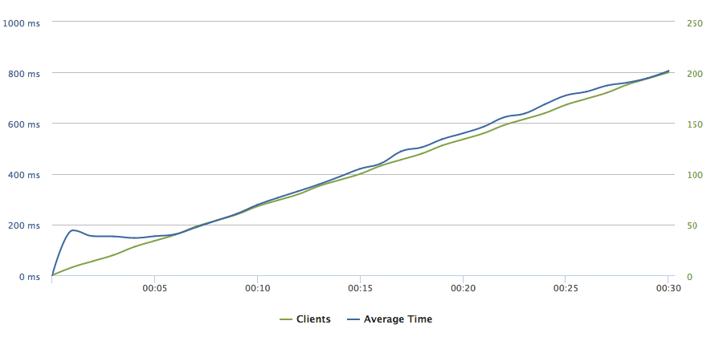
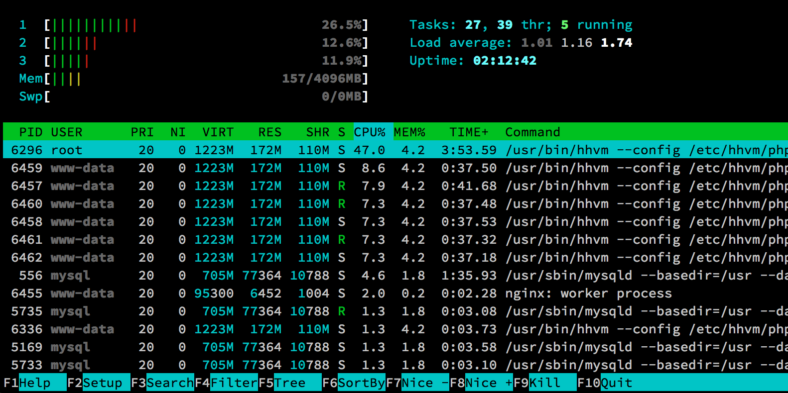
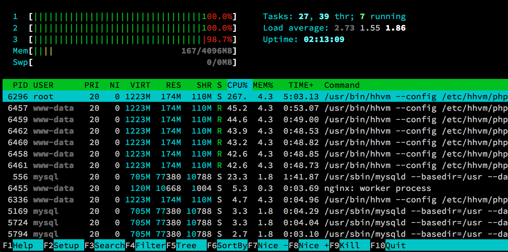
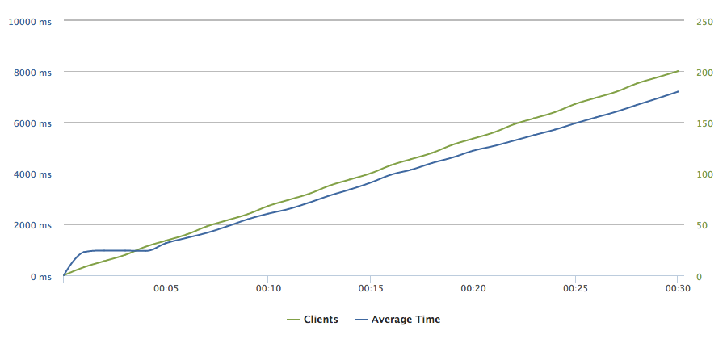

# Nginx with HHVM

In this section, we are going to substitute PHP-FPM with a different FastCGI PHP interpreter, HHVM and load-test it as we did with the earlier technologies. 

"HipHop Virtual Machine (HHVM) is a process virtual machine based on just-in-time (JIT) compilation, serving as an execution engine for PHP. [...] By using the principle of JIT compilation, executed PHP [...] code is first transformed into intermediate HipHop bytecode (HHBC), which is then dynamically translated into the x86-64 machine code, optimized and natively executed. This contrasts to the PHP's usual interpreted execution, in which the Zend Engine transforms the PHP source code into opcodes as a form of intermediate code, and executes the opcodes directly on the Zend Engine's virtual CPU."[^1]

## Load testing Nginx with HHVM

Within your command line, navigate to the wordpress-ansible directory and run the "nginx_hhvm.yml" Ansible playbook:

```
ansible-playbook -i hosts nginx_hhvm.yml
```

Analogous to the load testing Apache with mod_php, we create a new test on Loader.io with the same configuration.[^2] As HHVM is transforming and optimizing the PHP code during the initial requests, we have made several ones before running the load testing to get more accurate results (response time for the initial request was more than 10 seconds long).



Reviewing the above chart, we can see that average response times have decreased from the 2-second to under 1-second levels. When 200 simultaneous requests are sent to the server, we receive them after 800 ms in average. This means that just by using HHVM instead of PHP-FPM, the performance of our server increases 2,5 times. What is more, the count of successful responses leaps to around 5800, thus nearly tripling the throughput of the server.[^3]





Looking at the Htop process viewer screenshot, in comparison to using PHP-FPM, RAM usage more than tripled. However, it is still relatively low, especially compared to the memory usage when using Apache with mod_php.

If this was a competition, choosing Nginx with HHVM as your web-serving stack would beat all its contestants, therefore we recommend going with it.

## Advanced WordPress and HHVM

Our standard test did not benchmark HHVM's full potential, as we could observe from the figure 3.8. We will make the WordPress-powered site more complex. The new installation will include:

- several plugins, such as WooCommerce, Jetpack, WordPress SEO by Yoast and others[^4]
- a free e-commerce theme Storefront[^5]
- WooCommerce dummy data
- WP Test dummy data[^6]

In order to have the advanced WordPress configured, run the "wordpress_advanced.yml" playbook:

```
ansible-playbook -i hosts wordpress_advanced.yml
```

We configured the Loader.io test to send requests to two different URL addresses, the root of the server and to "?product=woo-ninja-3" (a WooCommerce product page).[^7]. The results can be seen in the figure 3.11. Average response times declined from under 1-second to around 7-second levels, which is also reflected in the count of successful responses (1237 versus 5769). Installing complex WordPress plugins and themes has clearly a profound impact on the site's performance.



