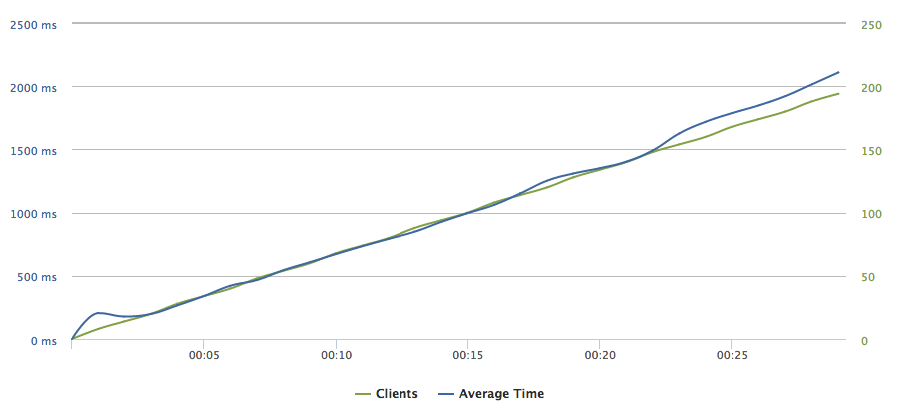
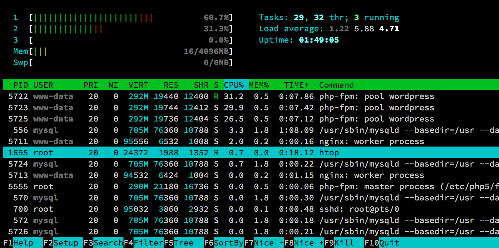
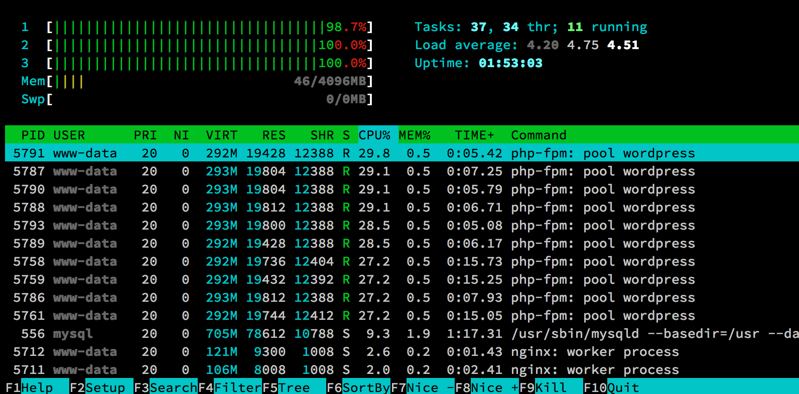

# Nginx with PHP-FPM

"Nginx (pronounced "engine-x") is an open source [...] web server. The nginx project started with a strong focus on high concurrency, high performance and low memory usage. [...] Nginx uses an asynchronous event-driven approach to handling requests, instead of the Apache HTTP Server model that defaults to a threaded or process-oriented approach, where the Event MPM is required for asynchronous processing. Nginx's modular event-driven architecture can provide more predictable performance under high loads."[^1]

Due to Nginx's asynchronous event-driven nature, its primary use case scenario is to relay the incoming requests to another application for processing, such as PHP-FPM, as quickly as possible, thus being able to handle large amounts of concurrent connections.

PHP-FPM is a FastCGI server bound to a TCP port or socket, bundled with the official PHP interpreter. It listens for PHP requests (request for a PHP script), responding with the resulting content (usually HTML). Comparing Apache's mod_php with PHP-FPM, while a PHP request is processed by Apache directly, in case of Nginx, it has to be relayed to PHP-FPM, which is able to process it. We do not have to know how it works in a greater depth to understand that when a request is flowing through multiple applications, more server resources have to be consumed. On the other hand, as Nginx and PHP-FPM are specialized applications, they are more efficient when put together. It can be observed from the figures below.

## Load testing Nginx with PHP-FPM

Within your command line, navigate to the wordpress-ansible directory and run the "nginx_php-fpm.yml" Ansible playbook:

```
ansible-playbook -i hosts nginx_php-fpm.yml
```

Analogous to the load testing Apache with mod_php, we create a new test on Loader.io with the same configuration.[^2]



Figure 3.5 shows us similar average response times to the figure 3.1 (Apache with mod_php), even slightly worse. However, screenshots of Htop during 1 and 22 seconds into the test depict a different situation. As we can see, even under 150 simultaneous client requests, server RAM usage is only at 46 MB. Compared with Apache's 770 MB, by installing Nginx with PHP-FPM we optimized the server markedly. We can also see that Nginx is not using more than 3% of the server's CPU for the reason that it was programmed to manage thousands of concurrent connections and we sent only 200 of them. A better benchmark for Nginx performance is described in the ??? section.

Although we could tweak Apache with mod_php to have a better performance, it has a steep learning curve, requiring a considerable amount of time. The objective of this work is to provide web administrators and WordPress developers with solutions they can easily implement, therefore we will not elaborate on this topic in greater detail.





Astute readers might notice that MariaDB process (/usr/sbin/mysqld) consumes more memory (RES column) than Htop's Mem gauge total used memory is showing (46 MB) alone. As we have explained from the figure ???, memory bar is not counting the cached memory to its total used value. The only indication is the blue bars which follow the pink ones.

[^1]: Wikipedia: [Nginx](http://en.wikipedia.org/wiki/Nginx)

[^2]: Loader.io: [Nginx PHP-FPM Loader.io testing results page](http://ldr.io/1cT2D14)