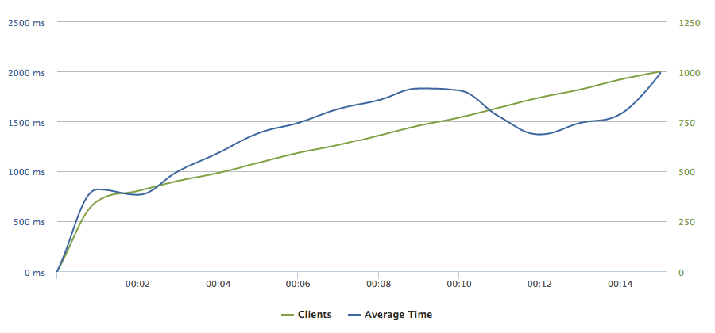
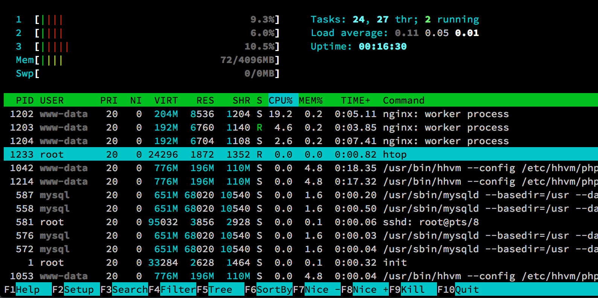

# Page Caching

Page caching is storing the output of a PHP interpreter (such as PHP-FPM or HHVM) on a disk or in RAM on the first request to a page (URL) and serving this stored (cached) content on subsequent ones. Page caching increases the performance of a web server considerably. To put it in simplistic terms, page caching converts a dynamic website into a static one. The most noticeable downside of page caching is that it is hard, if not impossible, to cache highly dynamic pages like constantly changing homepage or user profile page. In such circumstances, it is usually better to bypass the caching mechanisms and process the request with a PHP interpreter.

The easiest (but not the most performant) way to achieve page caching in a WordPress-based site is to use a plugin such as W3 Total Cache or WP Super Cache. These plugins store a page on your server's disk as an HTML file. When the page is requested for the second time, the HTML file is sent back as a response without having to process it within WordPress, thus saving hundreds to thousands of milliseconds. The largest advantages of these plugins are their ease of use. They usually come with simple user interface and a mechanism to bypass the cache for logged in users and highly dynamic pages. It is also quite straightforward to purge the cache if a new piece of content has been added with most of the plugins doing it automatically.

However, we prefer to set up page caching at a lower level, directly in Nginx. Nginx FastCGI module[^1] includes a caching mechanism. The advantages of this approach are that the content is stored in RAM (as opposed to a disk) and with the use of various Nginx directives[^2], we get a fine-grained control over the caching process. What is more, there is a plugin called Nginx Helper, which is able to clear the cache when a new WordPress post or page is added. In our work, we have used Nginx's FastCGI cache to increase the server's web-serving performance.

We are going to benchmark the performance of our testing server with Nginx FastCGI caching enabled. Create a new Loader.io test with a duration of 15 seconds, maintaining client load from 300 to 1000 simultaneous clients to the root of our WordPress-powered site.[^3] To configure the FastCGI caching, within your command line, navigate to the wordpress-ansible directory and run the "nginx_hhvm_fastcgi_cache.yml" Ansible playbook:

```
ansible-playbook -i hosts nginx_hhvm_fastcgi_cache.yml
```

The resulting clients versus average response time chart can be observed in the figure 4.1. Note that we did a manual request (non-cached one) before starting the test for Nginx to cache it.



With our three-CPU testing server, we were able to serve 1000 concurrent requests while maintaining the average response time under 2000 ms. Compare it with the previous testing ???, where we barely served 200 concurrent requests under 8000 ms average response time. Another interesting statistic is the output of Htop process viewer, which can be observed in the figure below.



9 seconds into the benchmarking (around 750 simultaneous requests), the server's CPU usage is at less than one-quarter. The single cached page is not taking large amounts of memory, as can be seen in RAM usage (72 MB out of 4096). We can confidently conclude this section by saying that, as was stated before, Nginx is an efficient web-serving software.