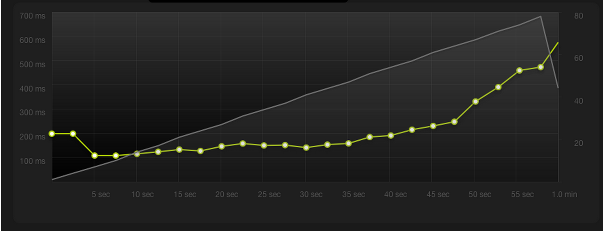

# Similar Studies

In this section, we will be analyzing and discussing similar studies done by other web developers and programmers. Before we look at their results, we need to have a basic understanding of the web serving software they were comparing.

**Apache HTTP**, also called Apache, is a free and open source world's most widely used (57.5%[^1] of all websites whose web server we know) web server software. **Nginx**, released nearly 10 years later than Apache, was designed with a high concurrency, high performance and low memory usage in mind, specifically to solve the C10K problem.[^2]

Both **PHP** and **HHVM** are PHP script interpreters. HipHop Virtual Machine (HHVM), released by Facebook in 2011, was developed to increase the performance of PHP script execution on the Facebook site. Both of them are open source and free to use.

## Using Nginx, Apache, APC and Varnish in Different Scenarios — Garron.me

Guillermo Garron has performed several comparisons between the most popular web-serving and caching software.[^3] He used a relatively weak web server with highly limited computing power — 512MB RAM, a shared CPU and a shared disk. However, the result of his experiment is clear — caching the output of the PHP interpreter has a considerable impact on loading times of WordPress-powered web page.

From the figure 1.4, we observe that if the number of simultaneous visitors exceeds ten, response times of the web server start to dramatically decrease in a linear fashion. On the other hand, response times start to worsen only after thirty concurrent visitors, as we can see from the figure 1.5.

Although using Nginx instead of Apache HTTP yields additional performance gains, they are less notable. Nginx strengths are demonstrated when a website is composed of many resources. However, Garron used a standard WordPress installation, with no extra plugins or complex custom themes.

## WordPress on HHVM vs WordPress on PHP-FPM — WPengine.com

WPengine.com is a company specializing in offering WordPress web hosting services. They have introduced a new hosting plan which differentiates itself from others by using HHVM PHP interpreter instead of the standard PHP. Before releasing the hosting plan, a study, in which the performance of HHVM versus PHP was compared, was undertaken. The study concluded with a fact that HHVM increased the speed of their servers by 600%.[^4] This fact is displayed in the figure 1.6.

In the study, they found out that HHVM was not 100% stable yet and occasionally stopped working. Their solution to this problem was to redirect the incoming requests to a fallback PHP interpreter while HHVM got restarted. 

## WordPress HHVM vs PHP — xyu.io

Xiao Yu, a web developer, benchmarked[^5] WordPress running on PHP vs WordPress running on HHVM. His findings show a similar pattern to the findings of WPengine.com???link-to-section???. Outcome of his experimentation can be observed in table below. 

|           | Response Time | Ok Responses | Errors / Timeouts |
|-----------|---------------|--------------|-------------------|
| Anon PHP  | 4.091         | 8,939        | 0.94%             |
| Anon HHVM | 2.122         | 18,308       | 0.00%             |
| Change    | 48.1%         | 2.05X        |         -         |
| Auth PHP  | 20.688        | 457          | 74.17%            |
| Auth HHVM | 14.359        | 1,242        | 43.45%            |
| Change    | 30.6%         | 2.72X        |         -         |

"In the numbers above anonymous requests represents hits to various pages without a WordPress logged in cookie which are eligible for Batcache caching whereas authorized requests are hits to the same pages with a login cookie thus bypassing page caching."[^5]

[^1]W3Techs: [Usage statistics and market share of Apache for website](http://w3techs.com/technologies/details/ws-apache/all/all)

[^2]Dan Kegel: [The C10K problem](http://www.kegel.com/c10k.html)

[^3]Guillermo Garron: [Wordpress Performance Comparison: Using Nginx, Apache, APC and Varnish in Different Scenarios](http://www.garron.me/en/linux/apache-vs-nginx-php-fpm-varnish-apc-wordpress-performance.html)

[^4]WP Engine: [Announcing WP Engine’s High Availability HHVM Platform: Mercury – Labs Alpha](http://wpengine.com/2014/11/19/hhvm-project-mercury/)

[^5]Xiao Yu: [WordPress Performance with HHVM](http://www.xyu.io/2014/09/wordpress-performance-with-hhvm/)