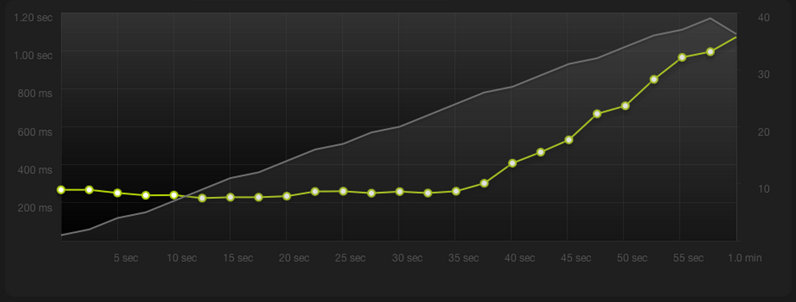

# Similar Studies

In this section, we will be analyzing and discussing similar studies done by other web developers and programmers. Before we look at their results, we need to have a basic understanding of the web serving software they were comparing.

**Apache HTTP**, also called Apache, is a free and open source world's most widely used (57.5%[^1] of all websites whose web server we know) web server software. **Nginx**, released nearly 10 years later than Apache, was designed with a high concurrency, high performance and low memory usage in mind, specifically to solve the C10K problem.[^2]

Both **PHP** and **HHVM** are PHP script interpreters. HipHop Virtual Machine (HHVM), released by Facebook in 2011, was developed to increase the performance of PHP script execution on the Facebook site. Both of them are open source and free to use.

## Using Nginx, Apache, APC and Varnish in Different Scenarios — Garron.me

Guillermo Garron has performed several comparisons between the most popular web-serving and caching software.[^3] He used a relatively weak web server with highly limited computing power — 512MB RAM, a shared CPU and a shared disk. However, the result of his experiment is clear — caching the output of the PHP interpreter has a considerable impact on loading times of WordPress-powered web page.

From the figure 1.4, we observe that if the number of simultaneous visitors exceeds ten, response times of the web server start to dramatically decrease in a linear fashion. On the other hand, response times start to worsen only after thirty concurrent visitors, as we can see from the figure 1.5.

[^1]W3Techs: [Usage statistics and market share of Apache for website](http://w3techs.com/technologies/details/ws-apache/all/all)

[^2]Dan Kegel: [The C10K problem](http://www.kegel.com/c10k.html)

[^3]Guillermo Garron: [Wordpress Performance Comparison: Using Nginx, Apache, APC and Varnish in Different Scenarios](http://www.garron.me/en/linux/apache-vs-nginx-php-fpm-varnish-apc-wordpress-performance.html)