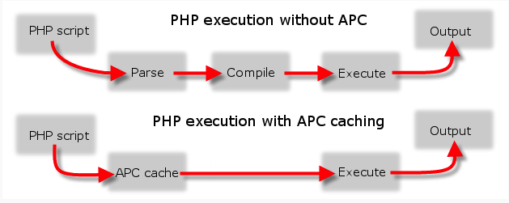

# Techniques for Improving Website Loading Speed in General

Before we can delve into solutions to our problems, we need to list and describe several general techniques and measures used to improve not only the website loading times, but also a server resources usage and load.

## Web-Serving Software Efficiency

Using the most performant and the least resource-hungry web-serving software is usually the most effective way of improving web page loading speed. Some studies have found that even small changes to configuration files can a difference. In our work, we are making comparisons between the two most popular web-serving applications, namely Apache HTTP and Nginx, as well as comparisons between different PHP interpreters. Jump to section \ref{nginx-apache} for more details and statistics. 

## Server-Side Caching

Let us divide server-side caching into four main categories:

1. Caching intermediate PHP code
2. Caching the output of PHP interpreter (so called “page cache”)
3. Static resources (files) caching
4. Database caching

### 1. Caching intermediate PHP code

PHP source code is interpreted on each run, thus the PHP interpreter has to read and collect all required files each time a new request is sent to our WordPress-based website. With PHP \gls{opcode} caching, an intermediate source code is generated on the first run and stored temporarily. When a new request comes, instead of going through all the files, PHP loads cached opcode and executes it. We can observe the process from the figure 1.3.[^1]

### 2. Caching the output of PHP interpreter (so called “page cache”)

While a website based on WordPress is dynamic, in some cases it is possible to store the constructed web page for subsequent usage. This process is usually called page caching and it is suitable for websites with static blocks of content. However, problems arise when we have to handle special cases such as when a visitor is logged into our website. In that case, we are not able to cache the request because other visitors would see the logged-in visitor’s cached content instead of a general one.

### 3. Static resources caching

When our website consists of a large number of smaller files such as JavaScript scripts, CSS stylesheets, images and others, caching these resources is an idea worth mentioning. They are constructed and loaded on the initial request, stored in a local web server cache and retrieved from the cache on subsequent requests.

The largest disadvantage of static file caching is usually a drop in free memory available to different needs of the web server, especially when files are cached in RAM memory.

### 4. Database caching

When multiple requests to our web server trigger the same database queries, it is reasonable to store the retrieved data for later use. When a subsequent request is made, querying the database is omitted, thus preserving valuable server resources and outputting the resulting web page faster.

## Client-Side Caching

What makes client-side caching different from the server-side caching is that data is stored locally in the visitor’s browser, not on the server to which the requests are made.[^2] The whole hypertext document with all its resources including JavaScript scripts and CSS stylesheets can get cached in client's browser storage, loaded from it on consecutive requests. Naturally, the most notable advantage of client-side caching is the fact that the user’s browser does not need to download the locally cached resources again.

On the other hand, we need to implement a mechanism which can handle resource changes on the server-side. When not done properly, some of the visitors might see outdated content due to the reason that the visitor’s browser has not been instructed to revalidate its cache.

## JavaScript and CSS Resource Minification and Combination

At the time of writing (early 2015), a large number of WordPress themes and plugins contain tens or more JavaScript scripts and CSS styles, especially the more professional ones. It is caused by the fact that users like having complex, polished and feature-rich websites. The problem with this fact is twofold:

- There is a limit on the number of concurrent downloads of resources from the same domain. Both Internet Explorer 8 and Google Chrome allow six concurrent downloads while Firefox eight.[^3]
- Each request carries an overhead of constructing a HTTP packet, sending it to the web server and waiting for the reply.

There are two well-known methods of solving this issue:

1. Resources combination and/or
2. resources minification.

### Resources combination

Resource combination is a process in which resources on the requested web page are collected into (preferably) single file which is then sent back to the visitor’s browser. There exist two main downsides of this approach. The first is that collecting the resources consumes additional CPU cycles on the server-side. Another disadvantage happens when the owner of the website modifies source code of any of the grouped resource. The whole group has to be gathered together again, including revalidating browser cache if present.

### Resources minification

JavaScript scripts and CSS stylesheets can be minified. Minification is a procedure in which parts of a script or a stylesheet are reduced or completely removed, thus reducing its size and length. Advanced minification tools are capable of refactoring them in a manner that they become even more compact.

[^1]inmotionhosting.com: [Speed up PHP with APC - Alternative PHP Cache](http://www.inmotionhosting.com/support/website/what-is/speed-up-php-with-apc)

[^2]Mark Nottingham: [Caching Tutorial for Web Authors and Webmasters](https://www.mnot.net/cache_docs/)

[^3]stackoverflow.com: [Get number of concurrent requests by browser](http://stackoverflow.com/questions/7456325/get-number-of-concurrent-requests-by-browser)