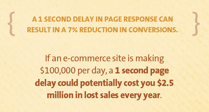

# The Problem

Website loading speed has a critical impact on page abandonment rate among its visitors. According to a Google experiment, website loading time worsened only by **half of a second** had a 20% drop in its visitor’s traffic.[^1] From the figure 1.1[^2], we can see a chart of page abandonment relative to a web page loading time in seconds. By the time a ten-second loading web page is displayed, more than 35% of its visitors will have closed the page.

To highlight the seriousness of this issue, imagine a situation in which an e-commerce site owner is making $100,000 per day. One-second page delay could potentially cost him or her $2.5 million in lost sales every year.[^2] See figure 1.2 for more detail.

What is more, Google incorporated site speed in search rankings in 2010[^3], meaning that the more time it takes to load a website, the lower it ranks in Google search results. We believe we have shown the reader enough evidence that optimizing the performance and speed of a website is crucial for its success, especially in today's fast-paced world.

[^1]KISSmetrics: [Speed Is A Killer – Why Decreasing Page Load Time Can Drastically Increase Conversions](https://blog.kissmetrics.com/speed-is-a-killer/)

[^2]KISSmetrics: [How Loading Time Affects Your Bottom Line](https://blog.kissmetrics.com/loading-time/)

[^3]Matt Cutts: [Google incorporating site speed in search rankings](https://www.mattcutts.com/blog/site-speed/)

