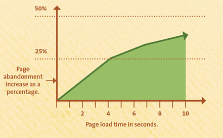

# The Problem

Website loading speed has a critical impact on page abandonment rate among its visitors. According to a Google experiment, website loading time worsened only by **half of a second** had a 20% drop in its visitor’s traffic.[^1] From the figure 1.1[^2], we can see a chart of page abandonment relative to a web page loading time in seconds. By the time a ten-second loading web page is displayed, more than 35% of its visitors will have closed the page.

[^1]: KISSmetrics: [Speed Is A Killer – Why Decreasing Page Load Time Can Drastically Increase Conversions](https://blog.kissmetrics.com/speed-is-a-killer/)

[^2]: KISSmetrics: [How Loading Time Affects Your Bottom Line](https://blog.kissmetrics.com/loading-time/)
